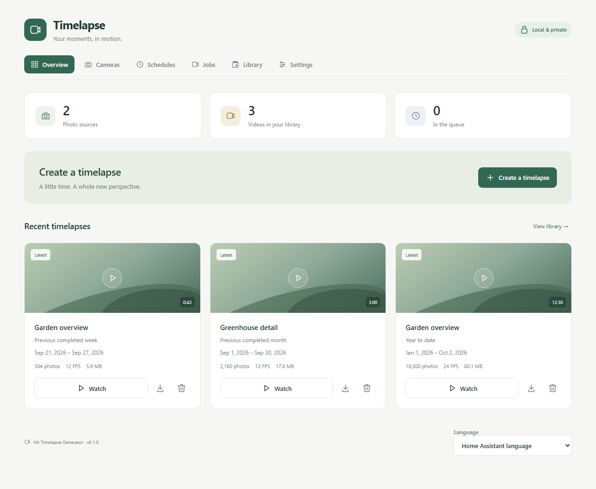
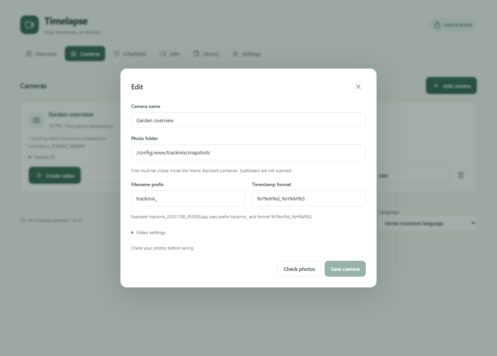

# HA Timelapse Generator

Turn timestamped photo archives into timelapse videos, directly inside Home Assistant.

[Türkçe kurulum rehberi](docs/kurulum-tr.md) · [Configuration & API](docs/configuration.md) · [MIT license](LICENSE)



*Panel screenshot uses demonstration data. Video cards have decorative covers; the Watch button opens the actual video.*

## Features

- Manage multiple photo folders from a sidebar panel, with filename matching preview.
- Generate the previous completed week/month, year to date, or an inclusive custom date range.
- Schedule weekly, monthly and daily year-to-date videos using Home Assistant's timezone.
- Adjust FPS, quality, resolution and timeout for each camera.
- Follow queued/running jobs, cancel or retry, and review skipped-file warnings.
- Watch, download and filter your dated archive, with a latest-video marker per camera and period.
- Keep videos until you delete them, or opt into retention by age. Source photos are never deleted.
- Home Assistant authentication for media; administrator checks for changes and generation.
- English and Turkish interfaces. No cloud service, camera credentials, extra add-on or Node.js installation required.

## Requirements

Home Assistant **2026.9 or newer**, HACS, accessible timestamped JPG/JPEG/PNG files, and FFmpeg with the `libx264` encoder. FFmpeg is already included in official HA OS and Container installations.

All paths are paths **inside Home Assistant's container**, not paths on your Windows PC or Docker host. Mount external photo folders into the HA container before configuring them. Encoding shares your HA machine's CPU; the integration uses one video worker and two encoder threads.

## Install with HACS

1. Open **HACS → menu → Custom repositories**.
2. Add `https://github.com/ahmetharunerturk/ha-tgen` with category **Integration**.
3. Download **HA Timelapse Generator** and restart Home Assistant.
4. Open **Settings → Devices & services → Add integration → HA Timelapse Generator**.
5. Keep `/media/ha_tgen` as the output folder, or choose a private folder under a configured media directory. `/config/ha_tgen` is also supported.
6. Open **Timelapse** in the sidebar, add a camera, check the photo matches, and save.

[Open this repository in HACS](https://my.home-assistant.io/redirect/hacs_repository/?owner=ahmetharunerturk&repository=ha-tgen&category=integration)

For manual installation, copy `custom_components/ha_tgen` into your HA configuration directory's `custom_components` folder, restart HA, and follow steps 4–6.

## Your existing Trackmix archive

| Field | Overall view | Detail view |
| --- | --- | --- |
| Name | Gesamtansicht | Detailansicht |
| Photo folder | `/config/www/trackmix/snapshots` | `/config/www/trackmix_obj1/snapshots` |
| Filename prefix | `trackmix_` | `trackmix1_` |
| Timestamp format | `%Y%m%d_%H%M%S` | `%Y%m%d_%H%M%S` |

For example, `trackmix_20251108_053000.jpg` is interpreted as November 8, 2025 at 05:30 in the HA timezone. Filenames must match the prefix plus timestamp exactly, apart from the extension. Only the selected folder is scanned; subfolders are not scanned.

Existing snapshot-producing automations can continue writing photos to these folders. Disable the old video-generation shell commands and schedules after confirming your first new video, to avoid running two encoders. Old generated MP4s are not automatically imported or deleted. New videos use the private archive instead of the old `/local/.../weekly.mp4` links.

## Start using it

Select **Create a timelapse**, choose a camera or all cameras, choose a period, and start. **Jobs** shows progress and warnings. **Library** provides playback and download.

All schedules begin disabled. Enable each camera's **Schedules** entries and select local times. Weekly jobs run on Monday, monthly jobs on the first day, and year-to-date jobs daily. Missed schedules are not backfilled. At DST fallback each schedule runs at most once per local date; a nonexistent spring-forward time is skipped. Running and queued jobs become **Interrupted** on HA restart or integration reload. **Retry** preserves the original period and dates while using the camera's current settings.



*Camera settings screenshot uses demonstration data.*

## Development

The runtime bundle is committed inside the integration so HACS installs it without a frontend build step.

```sh
python -m pip install pytest pytest-asyncio Pillow ruff tzdata
python -m pytest -q
npm ci
npm run typecheck
npm run build
python scripts/demo_video.py  # requires FFmpeg
npx playwright install chromium
npm test
```

Full HA adapter tests require Home Assistant 2026.9 on Linux with Python 3.14; install `homeassistant==2026.9.0 ha-ffmpeg==3.2.2` alongside the test dependencies. They use the real service registry, websocket decorators, Store and HTTP authentication. Browser tests use a demo transport and synthetic clip; they do not imply a test on physical HA OS hardware. CI also runs Hassfest and HACS validation. Tagged releases run every CI job before creating the release asset.

`npm run preview` serves demonstration data at `http://127.0.0.1:8124`. The demo page is development-only and is not included in the integration.

Report problems in [GitHub Issues](https://github.com/ahmetharunerturk/ha-tgen/issues) with the HA version, relevant task warnings and logs. Remove personal paths or signed media URLs before posting.
