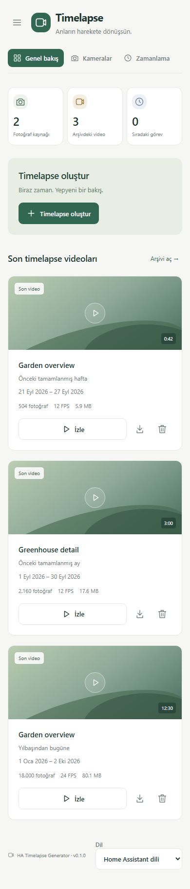

# Türkçe kurulum ve kullanım

HA Timelapse Generator, mevcut fotoğraf arşivlerini videoya dönüştüren bir HACS entegrasyonudur. Kameradan fotoğraf çekmez; mevcut fotoğraf çekme otomasyonların çalışmaya devam eder.

## Kurulum

1. Home Assistant **2026.9 veya üzerini** ve HACS'ı kullan.
2. HACS menüsünden **Özel depolar / Custom repositories** bölümünü aç.
3. `https://github.com/ahmetharunerturk/ha-tgen` adresini **Integration** kategorisinde ekle.
4. **HA Timelapse Generator** paketini indir ve Home Assistant'ı yeniden başlat.
5. **Ayarlar → Cihazlar ve servisler → Entegrasyon ekle** bölümünden **HA Timelapse Generator** seç.
6. Varsayılan `/media/ha_tgen` çıktı konumunu bırak veya HA medya klasörü altında özel bir konum seç. `/config/ha_tgen` de desteklenir.
7. Yan menüdeki **Timelapse** panelini aç.

[HACS'ta depoyu aç](https://my.home-assistant.io/redirect/hacs_repository/?owner=ahmetharunerturk&repository=ha-tgen&category=integration)

## Mevcut iki kameranı ekleme

**Kameralar → Kamera ekle** bölümünü aç ve aşağıdaki alanları doldur:

| Alan | Gesamtansicht | Detailansicht |
| --- | --- | --- |
| Fotoğraf klasörü | `/config/www/trackmix/snapshots` | `/config/www/trackmix_obj1/snapshots` |
| Dosya adı öneki | `trackmix_` | `trackmix1_` |
| Tarih biçimi | `%Y%m%d_%H%M%S` | `%Y%m%d_%H%M%S` |

**Fotoğrafları kontrol et** düğmesine bas. Eşleşen dosya sayısını ve örnek tarihleri doğrula, ardından kamerayı kaydet. Bir klasör boş olsa da kontrol başarılıysa kaydedilebilir; video üretmek için en az iki geçerli fotoğraf gerekir.

Dosya adı önek ve tarih biçimiyle tam eşleşmeli. Örneğin `trackmix_20251108_053000.jpg` kabul edilir. JPG, JPEG ve PNG desteklenir; alt klasörler taranmaz. Klasör yolları HA konteynerinin içinden görülen yollar olmalı. Docker kullanıyorsan dış klasörü HA konteynerine bağla.

Video ayarlarından FPS, yıllık FPS, CRF kalite değeri, çözünürlük ve zaman aşımını değiştirebilirsin. Küçük CRF daha yüksek kalite ve genellikle daha büyük dosya anlamına gelir. Varsayılan FPS 12, yıllık FPS 24, CRF 23 ve zaman aşımı 3600 saniyedir.

## Video üretme ve zamanlama

**Timelapse oluştur** düğmesinden tek kamerayı veya tüm kameraları seç. Önceki tamamlanmış hafta, önceki tamamlanmış ay, yılbaşından bugüne veya özel tarih aralığını kullan. Özel aralıkta başlangıç ve bitiş günleri dahil edilir.

**Görevler** bölümünde ilerlemeyi ve hataları gör, işi iptal et veya tekrar dene. Tekrar deneme ilk görevin dönemini ve tarihlerini korur, kameranın güncel ayarlarını kullanır. Bozuk veya tarihi okunamayan dosyalar atlanır ve raporlanır.

**Zamanlama** bölümünde haftalık üretim pazartesi, aylık üretim ayın ilk günü, yıllık üretim her gün çalışır. Saatler HA saat dilimindedir. Zamanlamalar başlangıçta kapalıdır. Kaçırılan görevler geriye dönük çalıştırılmaz. Yaz saati geçişinde bulunmayan bir saat atlanır; kış saati geçişinde aynı gün iki kez üretim yapılmaz.

HA yeniden başlatıldığında bekleyen veya çalışan işler **Kesintiye uğradı** durumuna geçer. Kaynakları kontrol ettikten sonra panelden tekrar başlatabilirsin.

## Arşiv ve eski betikten geçiş

**Arşiv** bölümünde videoları filtrele, izle veya indir. Üretilen her video ayrı dosyadır; kamera ve dönem bazında son başarılı video işaretlenir. Videolar HA oturumu ile erişilir; herkese açık `www` klasörüne yazılmaz.

İlk yeni videonu doğruladıktan sonra eski `timelapse_generator.py` betiğini çağıran video otomasyonlarını kapat. Fotoğraf çekme otomasyonlarını koru. Eski MP4 dosyaları otomatik aktarılmaz veya silinmez; eski `/local/.../weekly.mp4` bağlantıları yeni özel arşivin bağlantılarıyla aynı değildir.

**Ayarlar → Videoları saklama süresi** varsayılan olarak `0` değerindedir ve otomatik silme kapalıdır. Pozitif gün sayısı girersen daha eski üretilmiş videolar temizlenir. Kaynak fotoğraflar ve uygulamanın üretmediği dosyalar silinmez.

*Örnek verilerle mobil ekran görüntüsü.*
